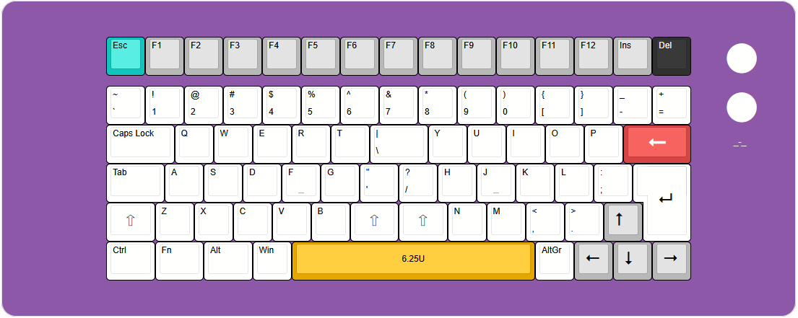

#  ergonomic\_-\_geometry

### eg2n79ki

%0A0&=%7B%0A%5B&=%7D%0A%5D&=%2F_%0A-&=+%0A%2F=&_x:0.75&c=%23b8b8b8&t=%23ffffff&a:7&f:9&d:true%3B&=%3Ci%20class%2F=%22fa%20fa-circle%20fa-2x%22%3E%3C%2F%2Fi%3E%3B&@_x:2.5&c=%23ffffff&t=%23000000&a:4&f:3&w:1.75%3B&=Caps%20Lock&=Q&=W&=E&=R&=T&_w:1.5%3B&=%7C%0A%5C&=Y&=U&=I&=O&=P&_c=%23d64545&t=%23ffffff&a:7&f:9&w:1.75%3B&=%3Ci%20class%2F='fa%20fa-long-arrow-left'%3E%3C%2F%2Fi%3E&_c=%23ffffff&f:3&w:2.5&d:true%3B&=%2F_-%2F_%3B&@_x:2.5&t=%23000000&a:4&w:1.5%3B&=Tab&=A&=S&=D&_n:true%3B&=F&=G&=%22%0A'&=%3F%0A%2F%2F&=H&_n:true%3B&=J&=K&=L&=%2F:%0A%2F%3B&_x:0.25&a:7&f:9&w:1.25&h:2&w2:1.5&h2:1&x2:-0.25%3B&=%3Ci%20class%2F='kb%20kb-Return-2'%3E%3C%2F%2Fi%3E%3B&@_x:2.5&w:1.25%3B&=%E2%87%A7&_a:4&f:3%3B&=Z&=X&=C&=V&=B&_a:7&f:9&w:1.25%3B&=%E2%87%A7&_w:1.25%3B&=%E2%87%A7&_a:4&f:3%3B&=N&=M&=%3C%0A,&=%3E%0A.&_c=%23b8b8b8&a:7&f:9%3B&=%3Ci%20class%2F='kb%20kb-Arrows-Up'%3E%3C%2F%2Fi%3E%3B&@_x:2.5&c=%23ffffff&a:4&f:3&w:1.25%3B&=Ctrl&_w:1.25%3B&=Fn&_w:1.25%3B&=Alt&=Win&_c=%23e6a600&a:7&w:6.25%3B&=6.25U&_c=%23ffffff&a:4%3B&=AltGr&_c=%23b8b8b8&a:7&f:9%3B&=%3Ci%20class%2F='kb%20kb-Arrows-Left'%3E%3C%2F%2Fi%3E&=%3Ci%20class%2F='kb%20kb-Arrows-Down'%3E%3C%2F%2Fi%3E&=%3Ci%20class%2F='kb%20kb-Arrows-Right'%3E%3C%2F%2Fi%3E%3B&@_y:-0.25&x:19&c=%23a96cf5&t=%23a96cf5&f:3&d:true%3B&=)